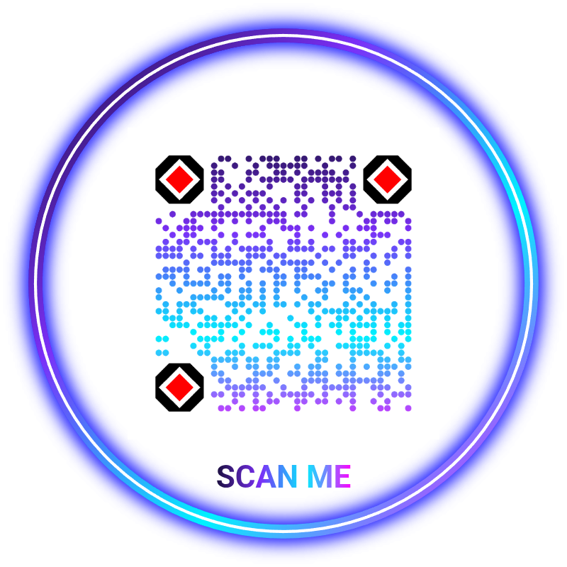
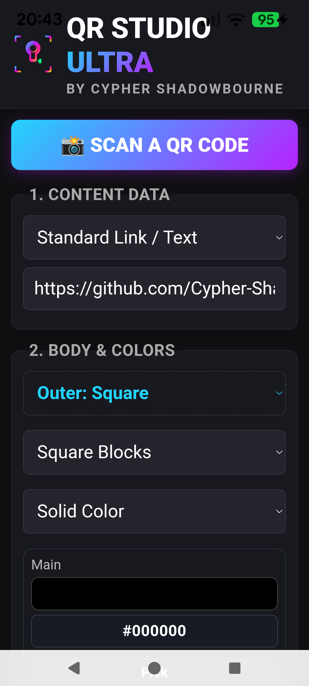
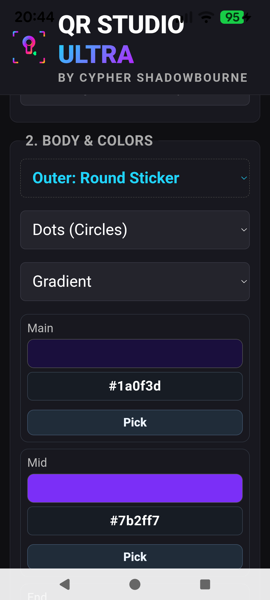
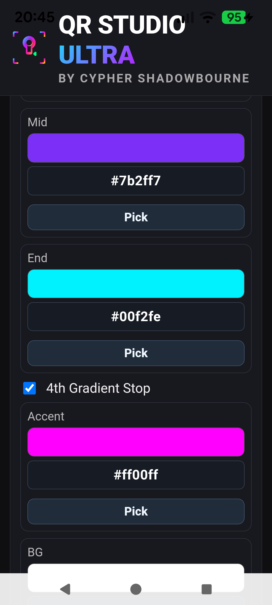
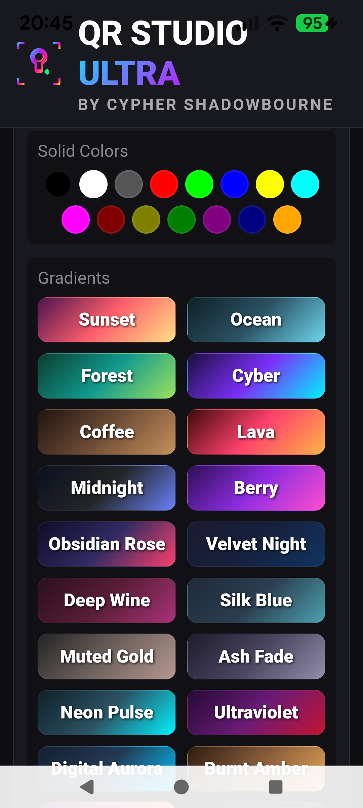
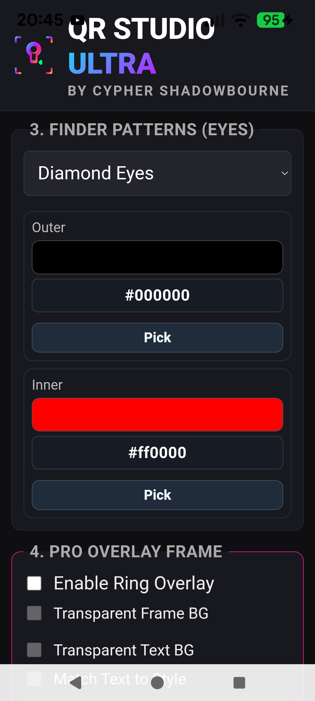
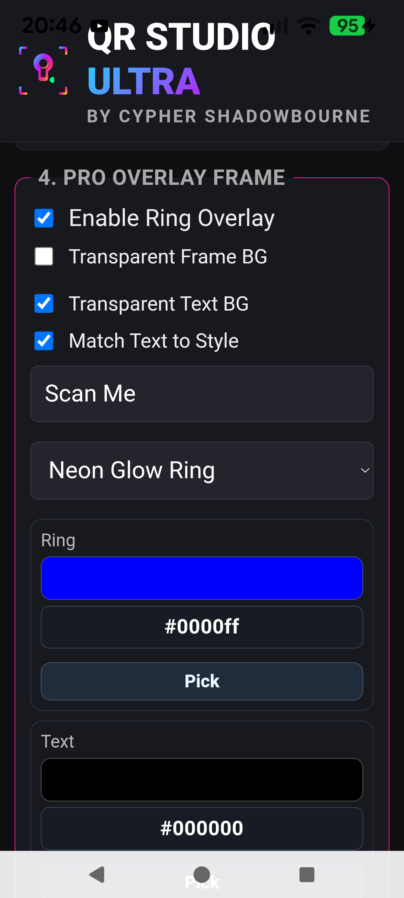
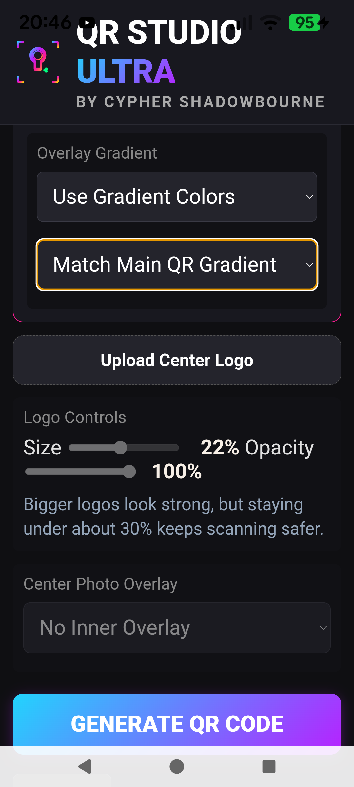
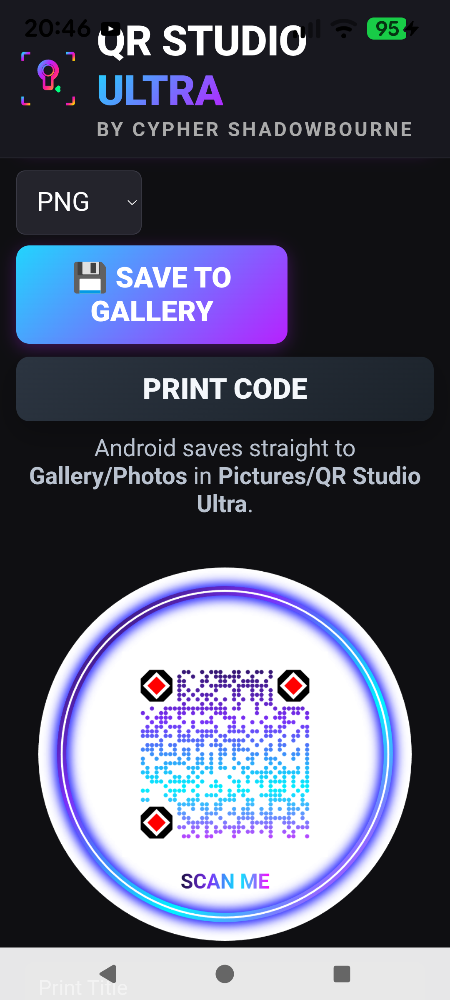

# QR Studio Ultra


QR Studio Ultra is a privacy-first QR and barcode studio built with Svelte, Tauri, and a native Rust rendering engine.

It is designed for people who want more than a basic black-and-white QR utility. The app focuses on polished visual output, practical payload generation, offline use, and native-quality exports without sending data to outside services.

> Latest Android builds in this repo include `QR-Studio-Ultra-Final.apk` and `QR-Studio-Ultra-Final-armv7.apk`.

## Screenshots

| | |
| --- | --- |
|  |  |
|  |  |
|  |  |
|  |  |
|  |  |

## Quick Start

If you want to run the project locally right away:

```bash
npm install
npm run tauri dev
```

If you only want the web UI during development:

```bash
npm run dev
```

## Release Picks

Current packaged Android builds in this workspace:

| Build | Best for |
| --- | --- |
| `QR-Studio-Ultra-Final.apk` | newer Android devices |
| `QR-Studio-Ultra-Final-armv7.apk` | older `armeabi-v7a` devices |

Desktop development runs through Tauri with:

```bash
npm run tauri dev
```

## What It Does

QR Studio Ultra currently supports:

- Custom QR generation with solid or multi-stop gradients
- Styled finder eyes and module shapes
- Frame and ring overlays
- Center logo upload with crop, size, and opacity controls
- QR and barcode scanning
- Wallet/payment QR creation with saved wallet profiles
- Common payload presets like URL, Wi-Fi, vCard, email, SMS, phone, geo, event, social links, and more
- Desktop Tauri use and Android packaging

## Feature Matrix

| Area | Included |
| --- | --- |
| QR styling | solid fills, multi-stop gradients, custom module shapes, styled eyes |
| Logos | upload, crop, center placement, size control, opacity control |
| Scanner | QR plus broader barcode format support, square targeting UI, animated scan line |
| Payloads | URL, Wi-Fi, vCard, email, SMS, phone, geo, event, social, crypto and more |
| Crypto | wallet profiles, richer payment URI generation, optional amount/label/message |
| Platforms | Tauri desktop workflow, Android builds, native save/share integration |
| Rendering | Rust-backed QR generation and logo compositing |

## Why This Project Exists

Most QR apps are either too plain, too intrusive, or too careless about quality.

QR Studio Ultra takes a different route:

- generation stays local
- rendering quality matters
- exports are meant to look intentional
- scanning reliability is treated as a product concern, not an afterthought

The app uses a Rust backend for the heavy rendering work and a Svelte frontend for fast interaction and UI flexibility.

## Highlights

### Native Rust Rendering

The QR image itself is rendered in Rust instead of relying entirely on a browser-only drawing path.

That gives the project tighter control over:

- module shaping
- finder eye rendering
- gradient fills
- logo compositing
- image export quality

Recent rendering work also moved toward cleaner direct-module sampling, which noticeably improved edge quality and reduced visual artifacts.

### Logo Workflow That Respects the QR

Center logos are handled with a crop-first workflow in the frontend and then composited natively in Rust.

Current logo features include:

- crop and framing flow before generation
- adjustable logo size
- adjustable logo opacity
- centered compositing with a protected backing plate to keep the code more scan-safe

### Scanner Support Beyond QR

The scanner is not limited to QR codes.

The app can request a wider set of barcode formats through the Tauri barcode scanner plugin, and the scanner UI includes:

- square target aperture
- animated scan line
- result type/format display

### Wallet and Payment Support

The crypto flow has moved beyond a single address field.

It now supports:

- multiple wallet networks
- saved wallet profiles
- optional amount, label, and message fields
- richer URI generation for supported networks

## Showcase Notes

The app is meant to cover two use cases that usually get split across multiple tools:

- a fast everyday QR utility that works locally
- a more polished studio for branded or visually customized codes

That is why the project mixes:

- native rendering work
- payload-oriented utility features
- visual customization controls
- Android practicality

The result is intentionally a little more ambitious than a standard generator.

## Tech Stack

- Frontend: Svelte, TypeScript, Canvas
- Native shell: Tauri 2
- Backend: Rust
- QR engine: `fast_qr`
- Image processing: `image`
- Native plugins: barcode scanner, dialog, shell/opener

## Project Structure

Key areas of the repo:

- `src/routes/+page.svelte`
  Main app UI, state, QR options, overlays, scanner UX, wallet flow

- `src-tauri/src/lib.rs`
  Native commands, QR rendering, image composition, mobile/desktop save logic

- `src-tauri/tauri.conf.json`
  Tauri app configuration

- `src-tauri/gen/android`
  Generated Android project files and Android-specific patches

## Running the Project

### Prerequisites

You will want:

- Node.js
- Rust toolchain
- Tauri prerequisites
- Android Studio / Android SDK if building for Android

Install dependencies:

```bash
npm install
```

### Web Dev

```bash
npm run dev
```

### Desktop Tauri Dev

```bash
npm run tauri dev
```

### Checks

```bash
npm run check
```

### Production Web Build

```bash
npm run build
```

## Typical Workflows

### Desktop Use

Best for:

- quick design iteration
- testing gradients and overlays
- checking logo placement
- working on the Svelte UI

Command:

```bash
npm run tauri dev
```

### Android Build and Device Testing

Best for:

- scanner validation on real cameras
- save/share testing
- performance checks on physical hardware
- verifying packaging for different Android CPU targets

Example:

```bash
npx tauri android build --target aarch64
```

## Android Builds

Example Android build command:

```bash
npx tauri android build --target aarch64
```

This repo has also been used to produce:

- an Android release APK for newer devices
- a separate `armeabi-v7a` build for older devices

If you are working on Android packaging, also inspect the generated Android files in `src-tauri/gen/android`, because this project includes local fixes and compatibility tweaks there.

## Android Notes

This project has needed a few practical Android-side adjustments for real builds, including:

- Kotlin plugin compatibility fixes in generated Gradle modules
- JVM target compatibility tweaks
- SDK version alignment

Those changes are part of why the repo includes generated Android project files instead of treating them as completely disposable.

## Product Direction

QR Studio Ultra is trying to sit in a useful middle ground:

- more polished than a throwaway utility
- more private than ad-heavy online tools
- more expressive than default QR libraries
- still grounded in real scan behavior

That means flashy ideas are welcome, but they need to earn their place by staying usable.

## Roadmap Flavor

The strongest future work for this project usually falls into one of these buckets:

- better visual polish that still scans cleanly
- stronger export and print workflows
- broader payload support
- cleaner native Android behavior
- refined desktop creator experience

That combination is where the app feels most distinctive.

## Contributing

Contributions are welcome.

Start here:

- `CONTRIBUTING.md`

If you are proposing rendering changes, scanner changes, or new styling systems, please read that guide first so the work lines up with the project’s priorities.

## License

This project is released under the `MIT` License.
